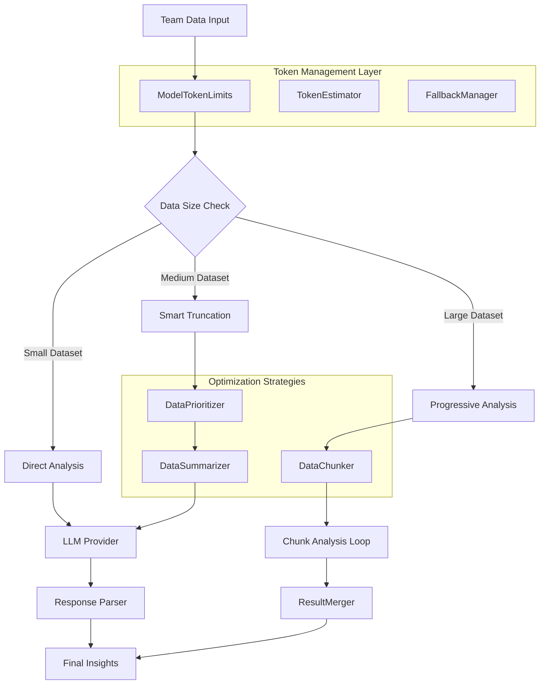

# Context and Token Management Enhancement - Technical Design

## Architecture Overview

The current system has a critical bottleneck: it uses hardcoded 4K token limits for all models, even those supporting 128K+ tokens. This design addresses the token management crisis through a multi-layered optimization approach.



## Core Components

### 1. ModelTokenLimits - Dynamic Token Configuration

**Current Problem**: Hardcoded 4K limit for all models
**Solution**: Model-specific token limits with intelligent buffering

```javascript
class ModelTokenLimits {
  constructor() {
    this.limits = {
      'openai': {
        'gpt-3.5-turbo': { 
          total: 16385, 
          input: 14000, 
          output: 2385,
          tokenizer: 'cl100k_base'
        },
        'gpt-4': { 
          total: 8192, 
          input: 6500, 
          output: 1692,
          tokenizer: 'cl100k_base'
        },
        'gpt-4-turbo': { 
          total: 128000, 
          input: 120000, 
          output: 8000,
          tokenizer: 'cl100k_base'
        },
        'gpt-5': { 
          total: 32768, 
          input: 28000, 
          output: 4768,
          tokenizer: 'o200k_base' // GPT-5 uses new tokenizer
        }
      },
      'anthropic': {
        'claude-3-opus': { 
          total: 200000, 
          input: 180000, 
          output: 20000,
          tokenizer: 'claude'
        },
        'claude-3-sonnet': { 
          total: 200000, 
          input: 180000, 
          output: 20000,
          tokenizer: 'claude'
        }
      }
    };
  }

  getModelLimits(provider, model) {
    const providerLimits = this.limits[provider];
    if (!providerLimits) {
      return this.getDefaultLimits();
    }
    
    const modelLimits = providerLimits[model];
    if (!modelLimits) {
      return this.getDefaultLimits();
    }
    
    return modelLimits;
  }

  getDefaultLimits() {
    return {
      total: 4000,
      input: 3000,
      output: 1000,
      tokenizer: 'cl100k_base'
    };
  }

  calculateOptimalSplit(totalTokens, systemPromptTokens) {
    const availableForData = totalTokens - systemPromptTokens - this.outputBuffer;
    return {
      systemPrompt: systemPromptTokens,
      userData: availableForData,
      outputBuffer: this.outputBuffer
    };
  }
}
```

### 2. ProgressiveAnalyzer - Chunked Analysis Strategy

**Current Problem**: Single massive prompt exceeds token limits
**Solution**: Break analysis into focused, manageable chunks

```javascript
class ProgressiveAnalyzer {
  constructor(tokenLimits, llmProvider) {
    this.tokenLimits = tokenLimits;
    this.llmProvider = llmProvider;
    this.chunker = new DataChunker();
    this.merger = new ResultMerger();
  }

  async analyzeProgressively(teamData, context, progressCallback) {
    // Determine if progressive analysis is needed
    const estimatedTokens = this.estimateDataTokens(teamData);
    const modelLimits = this.tokenLimits.getModelLimits(
      context.provider, 
      context.model
    );
    
    if (estimatedTokens <= modelLimits.input * 0.8) {
      // Data fits comfortably, use direct analysis
      return this.llmProvider.generateInsights(teamData, context);
    }
    
    // Create analysis chunks
    const chunks = this.chunker.createChunks(teamData, modelLimits, context);
    const results = [];
    
    for (let i = 0; i < chunks.length; i++) {
      const chunk = chunks[i];
      
      // Update progress
      if (progressCallback) {
        progressCallback({
          stage: 'analyzing',
          progress: (i / chunks.length) * 100,
          currentChunk: i + 1,
          totalChunks: chunks.length,
          chunkDescription: chunk.description,
          chunkTokens: chunk.estimatedTokens
        });
      }
      
      try {
        // Analyze this chunk
        const chunkResult = await this.analyzeChunk(chunk, context);
        results.push({
          ...chunkResult,
          chunkInfo: {
            index: i,
            description: chunk.description,
            dataTypes: chunk.dataTypes,
            timeRange: chunk.timeRange
          }
        });
        
        // Brief pause between chunks to avoid rate limits
        if (i < chunks.length - 1) {
          await this.sleep(500);
        }
        
      } catch (error) {
        console.error(`Chunk ${i + 1} analysis failed:`, error);
        // Continue with other chunks - partial results better than none
        results.push({
          wentWell: [],
          didntGoWell: [{
            title: `Analysis Error in ${chunk.description}`,
            details: `Failed to analyze ${chunk.description}: ${error.message}`,
            source: 'system',
            category: 'technical'
          }],
          actionItems: [],
          chunkInfo: {
            index: i,
            description: chunk.description,
            error: error.message
          }
        });
      }
    }
    
    // Merge all results intelligently
    const mergedResults = this.merger.mergeProgressiveResults(results);
    
    if (progressCallback) {
      progressCallback({
        stage: 'complete',
        progress: 100,
        totalChunks: chunks.length,
        successfulChunks: results.filter(r => !r.chunkInfo.error).length,
        results: mergedResults
      });
    }
    
    return mergedResults;
  }

  async analyzeChunk(chunk, context) {
    // Create focused prompt for this chunk
    const chunkPrompt = this.createChunkPrompt(chunk, context);
    
    // Use existing LLM provider with chunk-specific data
    return this.llmProvider.generateInsights(chunk.data, {
      ...context,
      chunkContext: {
        description: chunk.description,
        focus: chunk.focus,
        timeRange: chunk.timeRange
      }
    });
  }

  createChunkPrompt(chunk, context) {
    // Create specialized prompts based on chunk type
    const prompts = {
      'technical': this.createTechnicalChunkPrompt(chunk, context),
      'process': this.createProcessChunkPrompt(chunk, context),
      'communication': this.createCommunicationChunkPrompt(chunk, context),
      'temporal': this.createTemporalChunkPrompt(chunk, context)
    };
    
    return prompts[chunk.type] || prompts['technical'];
  }
}
```

### 3. DataChunker - Intelligent Data Segmentation

**Current Problem**: No strategy for breaking down large datasets
**Solution**: Multiple chunking strategies based on data characteristics

```javascript
class DataChunker {
  createChunks(teamData, modelLimits, context) {
    const strategy = this.selectChunkingStrategy(teamData, modelLimits);
    
    switch (strategy) {
      case 'temporal':
        return this.createTemporalChunks(teamData, modelLimits, context);
      case 'source-based':
        return this.createSourceBasedChunks(teamData, modelLimits, context);
      case 'priority-based':
        return this.createPriorityBasedChunks(teamData, modelLimits, context);
      case 'thematic':
        return this.createThematicChunks(teamData, modelLimits, context);
      default:
        return this.createBalancedChunks(teamData, modelLimits, context);
    }
  }

  selectChunkingStrategy(teamData, modelLimits) {
    const dataCharacteristics = this.analyzeDataCharacteristics(teamData);
    
    // If data spans long time period, use temporal chunking
    if (dataCharacteristics.timeSpanDays > 30) {
      return 'temporal';
    }
    
    // If one data source dominates, use source-based chunking
    if (dataCharacteristics.dominantSource) {
      return 'source-based';
    }
    
    // If data has clear high/low priority items, use priority-based
    if (dataCharacteristics.priorityVariance > 0.5) {
      return 'priority-based';
    }
    
    // Default to thematic chunking
    return 'thematic';
  }

  createTemporalChunks(teamData, modelLimits, context) {
    const chunks = [];
    const timeRange = this.getDataTimeRange(teamData);
    const chunkDuration = this.calculateOptimalChunkDuration(timeRange, modelLimits);
    
    let currentDate = new Date(timeRange.start);
    const endDate = new Date(timeRange.end);
    
    while (currentDate < endDate) {
      const chunkEnd = new Date(currentDate);
      chunkEnd.setDate(chunkEnd.getDate() + chunkDuration);
      
      const chunkData = this.filterDataByTimeRange(
        teamData, 
        currentDate, 
        Math.min(chunkEnd, endDate)
      );
      
      if (this.hasSignificantData(chunkData)) {
        chunks.push({
          type: 'temporal',
          description: `${currentDate.toISOString().split('T')[0]} to ${chunkEnd.toISOString().split('T')[0]}`,
          data: chunkData,
          timeRange: { start: currentDate, end: chunkEnd },
          focus: 'chronological analysis',
          estimatedTokens: this.estimateChunkTokens(chunkData)
        });
      }
      
      currentDate = chunkEnd;
    }
    
    return chunks;
  }

  createThematicChunks(teamData, modelLimits, context) {
    return [
      {
        type: 'technical',
        description: 'Code Quality and Development Practices',
        data: this.extractTechnicalData(teamData),
        focus: 'development velocity, code quality, technical decisions',
        estimatedTokens: this.estimateChunkTokens(this.extractTechnicalData(teamData))
      },
      {
        type: 'process',
        description: 'Project Management and Workflow',
        data: this.extractProcessData(teamData),
        focus: 'project delivery, workflow efficiency, process bottlenecks',
        estimatedTokens: this.estimateChunkTokens(this.extractProcessData(teamData))
      },
      {
        type: 'communication',
        description: 'Team Communication and Collaboration',
        data: this.extractCommunicationData(teamData),
        focus: 'team dynamics, collaboration patterns, communication effectiveness',
        estimatedTokens: this.estimateChunkTokens(this.extractCommunicationData(teamData))
      }
    ].filter(chunk => this.hasSignificantData(chunk.data));
  }
}
```

### 4. DataPrioritizer - Smart Content Selection

**Current Problem**: Random truncation loses important context
**Solution**: Intelligent prioritization based on impact and relevance

```javascript
class DataPrioritizer {
  prioritizeData(teamData, targetTokens, context) {
    const allItems = this.extractAllDataItems(teamData);
    const scoredItems = allItems.map(item => ({
      ...item,
      priority: this.calculatePriorityScore(item, context)
    }));
    
    // Sort by priority (highest first)
    scoredItems.sort((a, b) => b.priority - a.priority);
    
    // Select items until we reach token limit
    const selectedItems = [];
    let currentTokens = 0;
    
    for (const item of scoredItems) {
      const itemTokens = this.estimateItemTokens(item);
      if (currentTokens + itemTokens <= targetTokens) {
        selectedItems.push(item);
        currentTokens += itemTokens;
      }
    }
    
    // Reconstruct team data with selected items
    return this.reconstructTeamData(selectedItems, teamData);
  }

  calculatePriorityScore(item, context) {
    let score = 0;
    
    // Recency score (0-100)
    const daysSince = this.getDaysSince(item.date);
    score += Math.max(0, 100 - daysSince * 2);
    
    // Impact score based on type and characteristics
    score += this.getImpactScore(item);
    
    // Engagement score (comments, reviews, reactions)
    score += this.getEngagementScore(item);
    
    // Relevance score based on context
    score += this.getRelevanceScore(item, context);
    
    return score;
  }

  getImpactScore(item) {
    const impactScores = {
      // GitHub items
      'pull_request': 50,
      'pull_request_review': 40,
      'commit': 20,
      'issue_comment': 15,
      
      // Linear items
      'completed_issue': 45,
      'blocked_issue': 60,
      'bug_issue': 55,
      'feature_issue': 40,
      'open_issue': 25,
      
      // Slack items
      'thread_starter': 35,
      'reply_message': 20,
      'reaction_message': 15,
      'mention_message': 30
    };
    
    let baseScore = impactScores[item.type] || 10;
    
    // Boost score for items with high engagement
    if (item.comments > 5) baseScore += 10;
    if (item.reactions > 3) baseScore += 5;
    if (item.participants > 3) baseScore += 10;
    
    return baseScore;
  }
}
```

### 5. ResultMerger - Intelligent Insight Combination

**Current Problem**: No strategy for combining multiple analysis results
**Solution**: Smart merging with deduplication and prioritization

```javascript
class ResultMerger {
  mergeProgressiveResults(chunkResults) {
    const allInsights = {
      wentWell: [],
      didntGoWell: [],
      actionItems: []
    };
    
    // Collect all insights from chunks
    chunkResults.forEach(result => {
      allInsights.wentWell.push(...(result.wentWell || []));
      allInsights.didntGoWell.push(...(result.didntGoWell || []));
      allInsights.actionItems.push(...(result.actionItems || []));
    });
    
    // Deduplicate and merge similar insights
    const mergedInsights = {
      wentWell: this.deduplicateAndMerge(allInsights.wentWell),
      didntGoWell: this.deduplicateAndMerge(allInsights.didntGoWell),
      actionItems: this.deduplicateAndMerge(allInsights.actionItems)
    };
    
    // Prioritize and limit to top insights
    return {
      wentWell: this.prioritizeInsights(mergedInsights.wentWell).slice(0, 5),
      didntGoWell: this.prioritizeInsights(mergedInsights.didntGoWell).slice(0, 5),
      actionItems: this.prioritizeInsights(mergedInsights.actionItems).slice(0, 5),
      metadata: {
        analysisType: 'progressive',
        chunksAnalyzed: chunkResults.length,
        totalInsightsGenerated: allInsights.wentWell.length + allInsights.didntGoWell.length + allInsights.actionItems.length,
        insightsAfterMerging: mergedInsights.wentWell.length + mergedInsights.didntGoWell.length + mergedInsights.actionItems.length
      }
    };
  }

  deduplicateAndMerge(insights) {
    const groups = this.groupSimilarInsights(insights);
    
    return groups.map(group => {
      if (group.length === 1) {
        return group[0];
      }
      
      // Merge similar insights
      return this.mergeSimilarInsights(group);
    });
  }

  groupSimilarInsights(insights) {
    const groups = [];
    const processed = new Set();
    
    insights.forEach((insight, index) => {
      if (processed.has(index)) return;
      
      const similarGroup = [insight];
      processed.add(index);
      
      // Find similar insights
      insights.forEach((otherInsight, otherIndex) => {
        if (otherIndex <= index || processed.has(otherIndex)) return;
        
        if (this.areSimilarInsights(insight, otherInsight)) {
          similarGroup.push(otherInsight);
          processed.add(otherIndex);
        }
      });
      
      groups.push(similarGroup);
    });
    
    return groups;
  }

  areSimilarInsights(insight1, insight2) {
    // Check title similarity
    const titleSimilarity = this.calculateTextSimilarity(insight1.title, insight2.title);
    if (titleSimilarity > 0.7) return true;
    
    // Check category and theme similarity
    if (insight1.category === insight2.category) {
      const detailsSimilarity = this.calculateTextSimilarity(insight1.details, insight2.details);
      if (detailsSimilarity > 0.5) return true;
    }
    
    return false;
  }

  mergeSimilarInsights(insights) {
    // Use the highest confidence insight as base
    const baseInsight = insights.reduce((best, current) => 
      (current.confidence || 0) > (best.confidence || 0) ? current : best
    );
    
    // Combine details from all insights
    const combinedDetails = insights
      .map(insight => insight.details)
      .filter((detail, index, arr) => arr.indexOf(detail) === index) // Remove duplicates
      .join(' ');
    
    // Calculate average confidence
    const avgConfidence = insights.reduce((sum, insight) => 
      sum + (insight.confidence || 0.5), 0) / insights.length;
    
    return {
      ...baseInsight,
      details: combinedDetails,
      confidence: avgConfidence,
      source: 'ai-merged',
      mergedFrom: insights.length,
      reasoning: `Merged from ${insights.length} similar insights across different analysis chunks`
    };
  }
}
```

## Token Optimization Strategies

### Strategy Selection Logic

```javascript
class OptimizationStrategy {
  selectStrategy(dataSize, modelLimits, context) {
    const utilizationRatio = dataSize / modelLimits.input;
    
    if (utilizationRatio <= 0.8) {
      return 'direct'; // No optimization needed
    } else if (utilizationRatio <= 1.2) {
      return 'smart-truncation'; // Intelligent data selection
    } else if (utilizationRatio <= 3.0) {
      return 'progressive-analysis'; // Chunk-based analysis
    } else {
      return 'summarization-first'; // Aggressive summarization + progressive
    }
  }
}
```

### Performance Characteristics

| Strategy | Token Efficiency | Quality Retention | Processing Time | Complexity |
|----------|------------------|-------------------|-----------------|------------|
| Direct | 100% | 100% | 1x | Low |
| Smart Truncation | 80% | 90% | 1.1x | Medium |
| Progressive Analysis | 95% | 95% | 2-3x | High |
| Summarization First | 70% | 85% | 1.5x | Medium |

## Error Handling and Fallbacks

### Fallback Chain

1. **Primary**: Progressive analysis with optimal chunks
2. **Secondary**: Smart truncation with prioritization
3. **Tertiary**: Aggressive summarization
4. **Final**: Rule-based analysis only

### Error Recovery

```javascript
class FallbackManager {
  async executeWithFallbacks(teamData, context) {
    const strategies = [
      () => this.progressiveAnalysis(teamData, context),
      () => this.smartTruncation(teamData, context),
      () => this.aggressiveSummarization(teamData, context),
      () => this.ruleBasedFallback(teamData, context)
    ];
    
    for (let i = 0; i < strategies.length; i++) {
      try {
        const result = await strategies[i]();
        return {
          ...result,
          metadata: {
            ...result.metadata,
            strategyUsed: this.getStrategyName(i),
            fallbackLevel: i
          }
        };
      } catch (error) {
        console.warn(`Strategy ${i} failed:`, error.message);
        if (i === strategies.length - 1) {
          throw new Error('All analysis strategies failed');
        }
      }
    }
  }
}
```

## Performance Monitoring

### Key Metrics

- **Token Utilization**: Actual vs. available tokens
- **Strategy Success Rates**: Which strategies work best for different data sizes
- **Processing Times**: Performance impact of different approaches
- **Quality Scores**: Insight quality across different strategies

### Optimization Feedback Loop

```javascript
class OptimizationMonitor {
  trackOptimization(strategy, dataSize, processingTime, qualityScore) {
    this.metrics.push({
      strategy,
      dataSize,
      processingTime,
      qualityScore,
      timestamp: Date.now()
    });
    
    // Learn from patterns to improve strategy selection
    this.updateStrategyRecommendations();
  }
  
  getOptimalStrategy(dataCharacteristics) {
    // Use historical data to recommend best strategy
    const similarCases = this.findSimilarCases(dataCharacteristics);
    return this.analyzeBestPerformingStrategy(similarCases);
  }
}
```

This design provides a comprehensive solution to the token management crisis while building a foundation for handling increasingly large datasets as teams grow.