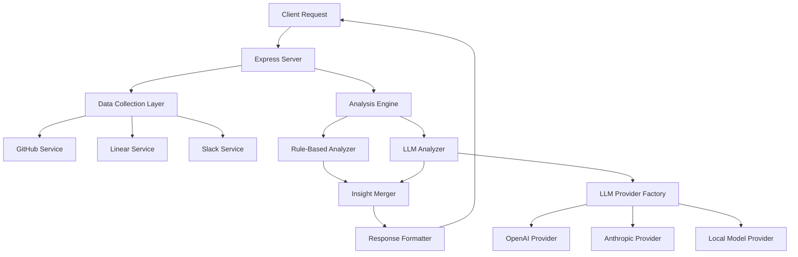

# Design Document

## Overview

This design enhances the existing retro insights generator by integrating Large Language Model (LLM) capabilities to provide more sophisticated analysis of team data. The system will maintain the current rule-based analysis as a reliable baseline while adding AI-powered insights that can identify complex patterns, sentiment, and relationships in the collected GitHub, Linear, and Slack data.

The design follows a hybrid approach where both rule-based and LLM insights are generated and merged, providing users with comprehensive retrospective analysis while maintaining system reliability through graceful fallbacks.

## Architecture

### High-Level Architecture



### Component Integration

The LLM analysis will be integrated into the existing `/api/generate-retro` endpoint as an additional analysis step that runs in parallel with the current rule-based analysis. This ensures backward compatibility and allows for graceful degradation.

## Components and Interfaces

### 1. LLM Service Factory

**Purpose:** Manages different LLM provider implementations and handles provider selection based on configuration.

**Interface:**
```javascript
class LLMServiceFactory {
  static createProvider(config) {
    // Returns appropriate LLM provider instance
  }
  
  static validateConfig(config) {
    // Validates provider configuration
  }
}
```

### 2. Base LLM Provider Interface

**Purpose:** Defines common interface for all LLM providers to ensure consistent behavior.

**Interface:**
```javascript
class BaseLLMProvider {
  async generateInsights(teamData, context) {
    // Returns structured insights object
  }
  
  async validateConnection() {
    // Tests provider connectivity
  }
  
  sanitizeData(data) {
    // Removes sensitive information
  }
}
```

### 3. Specific LLM Providers

#### OpenAI Provider
- Uses GPT-4 or GPT-3.5-turbo for analysis
- Implements token optimization strategies
- Handles rate limiting and retries

#### Anthropic Provider  
- Uses Claude models for analysis
- Implements Anthropic-specific prompt formatting
- Handles API-specific error responses

#### Local Model Provider
- Supports local LLM inference (Ollama, etc.)
- Provides privacy-focused option
- Handles local model availability checks

### 4. LLM Analyzer Service

**Purpose:** Orchestrates LLM analysis process, including data preparation, prompt engineering, and response parsing.

**Interface:**
```javascript
class LLMAnalyzer {
  constructor(provider, config) {}
  
  async analyzeTeamData(githubData, linearData, slackData, dateRange) {
    // Main analysis orchestration
  }
  
  preparePrompt(data, context) {
    // Creates optimized prompts for LLM
  }
  
  parseResponse(llmResponse) {
    // Converts LLM response to structured insights
  }
}
```

### 5. Insight Merger

**Purpose:** Combines rule-based and LLM insights, handling deduplication and source attribution.

**Interface:**
```javascript
class InsightMerger {
  static merge(ruleBasedInsights, llmInsights) {
    // Merges and deduplicates insights
  }
  
  static detectSimilarInsights(insight1, insight2) {
    // Identifies similar insights from different sources
  }
}
```

### 6. Data Sanitizer

**Purpose:** Removes or masks sensitive information before sending to external LLM providers.

**Interface:**
```javascript
class DataSanitizer {
  static sanitizeGitHubData(data) {
    // Removes emails, tokens, sensitive commit messages
  }
  
  static sanitizeLinearData(data) {
    // Removes personal identifiers, sensitive descriptions
  }
  
  static sanitizeSlackData(data) {
    // Removes user IDs, private channel content
  }
}
```

## Data Models

### LLM Configuration Model
```javascript
{
  provider: 'openai' | 'anthropic' | 'local',
  apiKey: string,
  model: string,
  maxTokens: number,
  temperature: number,
  timeout: number,
  enabled: boolean,
  privacyMode: boolean
}
```

### Enhanced Insight Model
```javascript
{
  title: string,
  details: string,
  source: 'rules' | 'ai' | 'hybrid',
  confidence: number, // 0-1 for AI insights
  category: string,
  data: object,
  llmProvider?: string, // For AI insights
  reasoning?: string // AI explanation
}
```

### Team Data Context Model
```javascript
{
  dateRange: { start: string, end: string },
  teamSize: number,
  repositories: string[],
  channels: string[],
  previousInsights?: object[] // For trend analysis
}
```

## Error Handling

### LLM Provider Failures
1. **Connection Failures:** Retry with exponential backoff (3 attempts)
2. **Rate Limiting:** Implement queue with delay based on provider limits
3. **Invalid Responses:** Parse what's possible, log errors, continue with rule-based insights
4. **Timeout:** Cancel request after configured timeout, fall back to rules

### Data Processing Errors
1. **Sanitization Failures:** Log error, exclude problematic data from LLM analysis
2. **Prompt Generation Errors:** Use simplified prompts or fall back to rules
3. **Response Parsing Errors:** Extract partial insights where possible

### Configuration Errors
1. **Invalid API Keys:** Validate on startup and before each request
2. **Missing Configuration:** Gracefully disable LLM features, show user warnings
3. **Model Unavailability:** Fall back to alternative models or rule-based analysis

## Testing Strategy

### Unit Tests
- **LLM Provider Tests:** Mock API responses, test error handling
- **Data Sanitization Tests:** Verify sensitive data removal
- **Insight Merger Tests:** Test deduplication and source attribution
- **Prompt Generation Tests:** Validate prompt structure and token limits

### Integration Tests
- **End-to-End LLM Flow:** Test complete analysis pipeline with mock data
- **Provider Switching:** Test configuration changes and fallbacks
- **Error Recovery:** Test graceful degradation scenarios

### Performance Tests
- **Token Usage Optimization:** Measure and optimize token consumption
- **Response Time:** Ensure LLM analysis doesn't significantly slow down retros
- **Concurrent Requests:** Test system behavior under load

### Security Tests
- **Data Sanitization:** Verify no sensitive data reaches external providers
- **API Key Protection:** Test credential handling and storage
- **Privacy Mode:** Validate local-only processing when enabled

## Implementation Phases

### Phase 1: Core Infrastructure
- Implement LLM service factory and base provider interface
- Create OpenAI provider implementation
- Add basic data sanitization
- Integrate into existing retro generation endpoint

### Phase 2: Enhanced Analysis
- Implement sophisticated prompt engineering
- Add Anthropic provider support
- Create insight merger with deduplication
- Add confidence scoring for AI insights

### Phase 3: Advanced Features
- Implement local model provider
- Add trend analysis using historical data
- Create advanced privacy controls
- Add performance monitoring and optimization

### Phase 4: User Experience
- Add LLM configuration UI
- Implement insight source indicators
- Add AI insight explanations
- Create cost and usage monitoring dashboard